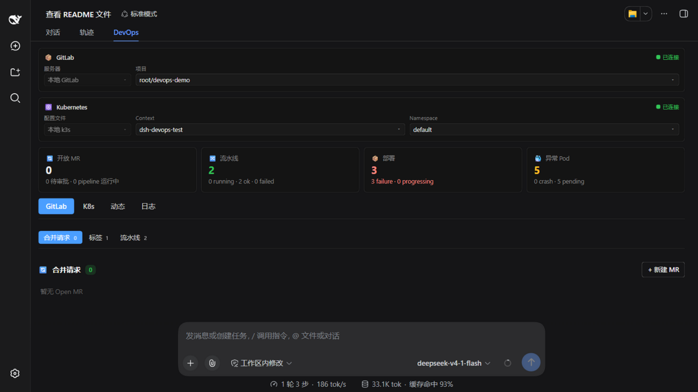
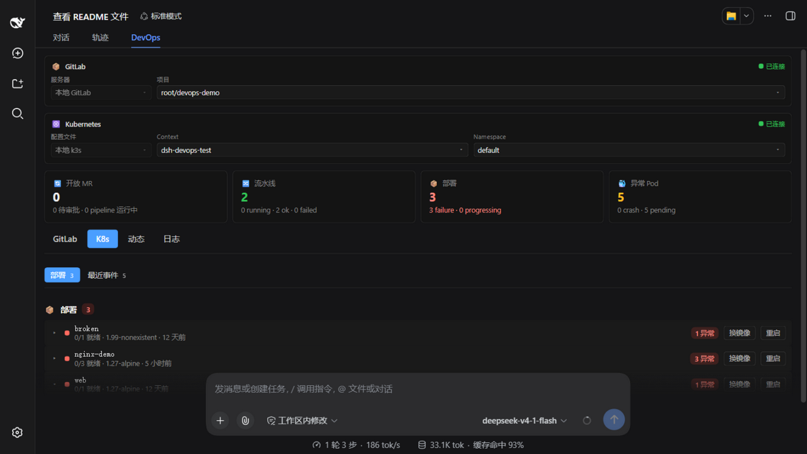

# @jacksonchen/dsh-devops

[](https://github.com/Jackson-chen97/dsh-devops/releases)
[](./LICENSE)


[](https://github.com/topics/dsh-plugin)

面向 DeepSeek Harness（DSH）的 GitLab + Kubernetes DevOps 控制平面：AI 工具、Web 控制台、Webhook 通知与告警监控。

[English](./README.md)

| GitLab 页签 | K8s 页签 |
|------------|---------|
|  |  |

## 功能特色

- **GitLab API**：创建/评审/关闭 MR、管理 Tag、监控 CI/CD Pipeline（可展开查看每个 Job 详情与构建日志）
- **Kubernetes API**：Deployment 状态、Pod 列表、事件、日志，支持更换镜像与滚动重启
- **监控台 UI**：双卡片切换器（GitLab 服务器/项目、kubeconfig/Context/Namespace）+ 二级 tab（合并请求/标签/流水线/部署/事件），全部下拉框可搜索，操作均以弹窗呈现
- **多配置管理**：支持多个 GitLab 服务器与多个 kubeconfig，可在监控台和设置页随时切换，选择自动保存
- **Webhook + 告警引擎**：GitLab Webhook → `followup()` 通知；后台轮询自动发送 Pipeline 失败/Pod 异常告警
- **国际化**：中文/英文字典注册到 DSH LocaleRuntime，跟随应用语言设置
- **自签证书集群**：基于 kubeconfig 的 CA 逐请求注入（`node:https` CA pinning）

## 安装

**🚀 推荐方式：完整本地目录安装流程（无需 npm 依赖）**

由于已知 `@deepseek-ai/dsh-type-meta` 包在 npm 上缺失的问题，**完整的本地目录安装是目前最可靠的安装方式**。详见 [GitHub discussion #410](https://github.com/deepseek-ai/deepseek-harness/discussions/410) 和 [discussion #984](https://github.com/deepseek-ai/deepseek-harness/discussions/984)。

---

### 方法一：完整设置指南（强烈推荐 ✅）

本指南将带你一步步完成克隆仓库和本地安装的全过程。

#### 步骤 1: 克隆仓库

```sh
# 创建项目工具目录（或沿用现有位置）
mkdir -p ~/dev/tools
cd ~/dev/tools

# 克隆 dsh-devops 仓库
git clone https://github.com/Jackson-chen97/dsh-devops
cd dsh-devops

# 验证项目结构
ls -la
```

#### 步骤 2: 在 DSH Profile 中安装插件

使用以下两种方法之一：

**选项 A: 使用 dsh plugin CLI 命令（自动完成依赖与 bundle 注册）**
```sh
dsh plugin --profile web add "~/dev/tools/dsh-devops"
```

**选项 B: 直接编辑 profile 的 package.json**

需要在 `dependencies` 与 `dsh.profile.bundles` 两处同时声明：

```json
{
  "dependencies": {
    "@jacksonchen/dsh-devops": "~/dev/tools/dsh-devops"
  },
  "dsh": {
    "profile": {
      "bundles": ["@jacksonchen/dsh-devops"]
    }
  }
}
```

#### 步骤 3: 重启 DSH

```sh
dsh --profile web
```

浏览器应自动打开 WebUI（默认 http://127.0.0.1:3080/）。

> 插件自带的 `cordis.patch.yml` 会作为 bundle 层自动挂载（含 DSH 0.1.5 的 connection 服务依赖补丁），
> **无需**再向 profile 的 `cordis.patch.yml` 手动插入插件条目。

#### 步骤 4: 配置 DevOps 设置

1. 打开 DSH 设置 → DevOps 页签
2. 点击「+ 添加服务器」填写 GitLab 信息（Base URL + Token）并测试连接
3. 点击「+ 添加配置文件」填写 kubeconfig 路径并测试连接
4. 保存并返回监控台

---

### 为什么选择本地目录？

✅ **离线可用** - 无需 pnpm registry  
✅ **绕过依赖问题** - 避免了 `dsh-type-meta` 的缺失问题  
✅ **免构建安装** - 仓库内 lib/ 由 tsdown 预构建（Node ESM host + 浏览器 CJS client），克隆即可加载  
✅ **支持热重载** - 修改 src/ 后执行 `pnpm build`，重启 DSH 立即生效  

---

### 其他方式（仅供参考）

待 maintainer 修复 `dsh-type-meta` 问题后，可使用这些传统方式：

**从 npm 安装（发布后）：**
```sh
dsh plugin --profile web add @jacksonchen/dsh-devops
```

**从 GitHub 安装：**
```sh
dsh plugin --profile web add https://github.com/Jackson-chen97/dsh-devops.git
```

等价的 pnpm 命令（在 profile 目录操作）：

```sh
cd ~/.dsh/profiles/web
pnpm add @jacksonchen/dsh-devops       # npm（发布后）
pnpm add https://github.com/Jackson-chen97/dsh-devops.git  # GitHub
```

## 使用

1. 打开 DSH 设置 > DevOps，添加 GitLab 服务器（Base URL + Token）和 kubeconfig 文件，保存到 `~/.dsh-devops/config.json`
2. 在监控台切换 GitLab 项目和 K8s 的 Context/Namespace——切换即保存，AI 调用立即跟随
3. 直接在监控台创建 MR/Tag、查看 Pipeline 与构建日志、操作 Deployment——或者直接对 AI 说，AI 通过同一套工具、同一份配置完成

也可以通过 cordis 补丁条目的 `config:` 块静态覆盖配置（headless 部署等场景）：

```yaml
- id: dsh-devops
  name: '@jacksonchen/dsh-devops'
  config:
    gitlab:
      baseUrl: 'https://gitlab.example.com'
      token: 'glpat-xxxx'
      projects:
        - id: main
          path: 'my-group/my-project'
          tokenEnv: 'GITLAB_TOKEN'
    k8s:
      kubeconfigs:
        - id: prod
          path: '~/.kube/config'
          context: 'prod'
```

> 注意结构差异：设置页写的是 `~/.dsh-devops/config.json`（`servers[]` / `kubeconfigs[]` 多条目结构）；
> cordis `config:` 使用上方 Schemastery schema 结构，且优先级高于设置文件。

## AI 工具

插件加载即注册全部工具——**无需任何 YAML 配置**。工具读取与设置页（设置 > DevOps）相同的配置（`~/.dsh-devops/config.json`），在监控台切换项目/集群对 AI 调用立即跟随；未配置时调用会返回「请先完成配置」的提示引导用户。

无头部署等高级场景仍可在 cordis 补丁条目中 `config:` 块中显式覆盖配置。

| 工具 | 说明 |
|------|------|
| `gitlab_mr_create` | 创建 MR（可指定 Reviewers，自动触发 Pipeline 监控） |
| `gitlab_mr_review` | 评审 MR（approve/request_changes/comment） |
| `gitlab_mr_list` | 列出 Merge Request |
| `gitlab_tag_create` | 创建 Git Tag |
| `gitlab_pipeline_status` | 查询 Pipeline 状态 |
| `gitlab_pipeline_jobs` | 列出 Pipeline 的 Job 明细 |
| `gitlab_pipeline_watch` | 启动/查询 Pipeline 监控 |
| `k8s_deployment_status` | 查询 Deployment 发布状态 |
| `k8s_pods` | 列出 Pod（含重启次数） |
| `k8s_events` | 获取最新 K8s 事件 |
| `k8s_logs` | 获取 Pod 日志（tail N 行） |

## 配置参考

### GitLab 配置

| 字段 | 必填 | 说明 |
|------|------|------|
| `baseUrl` | 是 | GitLab 实例地址 |
| `token` | 是 | GitLab 访问 Token（直连值） |
| `defaultProject` | 否 | 默认项目 ID（缺省取第一个） |
| `projects[].id` | 是 | 项目唯一标识 |
| `projects[].path` | 是 | GitLab 项目路径（group/project） |
| `projects[].token` | 二选一 | 项目级直连 Token（设置文件来源，优先于 tokenEnv） |
| `projects[].tokenEnv` | 二选一 | 存放 Token 的环境变量名（cordis 配置来源） |
| `projects[].defaultBranch` | 否 | 该项目的默认分支 |

### K8s 配置

| 字段 | 必填 | 说明 |
|------|------|------|
| `kubeconfigs[].id` | 是 | 集群唯一标识 |
| `kubeconfigs[].path` | 是 | kubeconfig 文件路径（支持 `~`） |
| `kubeconfigs[].context` | 否 | 使用的 Context（缺省取 current-context） |
| `kubeconfigs[].namespace` | 否 | 默认 Namespace 覆盖 |
| `defaultContext` | 否 | 默认集群 ID |
| `defaultNamespace` | 否 | 兜底 Namespace |

### Webhook 配置

| 字段 | 必填 | 说明 |
|------|------|------|
| `secret` | 是 | Webhook 校验共享密钥 |
| `projectPaths` | 否 | 项目路径白名单过滤 |
| `quietEvents` | 否 | 需要静默的事件类型 |

### Monitor 配置

| 字段 | 默认值 | 说明 |
|------|--------|------|
| `pollIntervalSec` | 30 | 轮询间隔（秒） |
| `cooldownSec` | 300 | 告警冷却时间，防止刷屏 |
| `pipeline[]` | ⚠️ | Pipeline 告警规则（trigger: failed/canceled/success） |
| `pod[]` | ⚠️ | Pod 告警规则（trigger: crash/restart/pending_stuck） |

## 开发

```sh
pnpm install         # 安装依赖
pnpm run typecheck   # TypeScript 类型检查
pnpm run build       # tsdown 双段构建：host ESM + 浏览器 client（输出到 lib/）
pnpm run test        # 运行 vitest 测试
pnpm run verify      # typecheck + build + test 一次跑完
```

**注意：** 本地 link 安装（profile 的 dependencies 指向本目录）加载的就是 lib/ 下的产物——修改 src/ 后必须重新执行 `pnpm build`，否则 DSH 加载的仍是旧代码。仓库内已提交构建产物，克隆后不执行构建也可直接安装。

## 架构

```
src/
├── index.ts            # 公共契约：name / inject / Config / apply
├── protocol.ts         # RPC 通道与端点名（host/client 共享）
├── config.ts           # Schemastery schema + 跨字段校验
├── types.ts            # 共享领域类型
├── core/               # 框架无关领域层
│   ├── gitlab/         #   GitLab REST 客户端 + 多项目路由/服务
│   ├── k8s/            #   K8s REST 客户端 + kubeconfig 解析 + 多集群路由/服务
│   ├── webhook/        #   纯函数事件解析 + followup 消息生成
│   ├── monitor/        #   告警规则求值 + 节流
│   ├── http.ts         #   fetch/node:https，超时 + CA 固定
│   └── logging.ts      #   ~/.dsh-devops/devops.log 写入/读取
├── host/               # DSH 宿主适配层
│   ├── plugin.ts       #   apply()：懒加载服务 + 工具 + RPC + webhook + monitor
│   ├── rpc.ts          #   /dsh-devops-read + /dsh-devops-write 通道
│   ├── endpoints-*.ts  #   RPC 端点（raw 参数，支持先测试后保存）
│   ├── tools*.ts       #   gitlab_* / k8s_* AI 工具定义
│   ├── services.ts     #   每次调用解析配置的懒加载服务
│   ├── config-store.ts #   ~/.dsh-devops/config.json 持久化 + 迁移
│   └── runtime-config.ts # cordis 覆盖 > 设置文件 解析
└── client/             # Web 控制台（React TSX + CSS Modules，中英 locale）
    ├── index.ts        #   slots.inject('settings.section' | 'conversation.view')
    ├── api.ts          #   DevopsClient —— 两条 RPC 通道的业务封装
    ├── locales.ts      #   zh/en 字典（DSH LocaleRuntime）
    ├── DevopsSettings.tsx / DevopsDashboard.tsx
    ├── DevopsUI.module.css
    └── ui.tsx          #   共享 UI 原语（可搜索 Select/Modal/StatCard/…）
```

## 环境要求

- Node.js ≥ 20（原生 `fetch`、ESM；开发构建需 ≥ 22）
- GitLab ≥ 16.0（MR Approvals API）
- Kubernetes API ≥ 1.25（apps/v1）
- 可访问 GitLab 和 K8s API 端点的网络

## 许可

MIT
